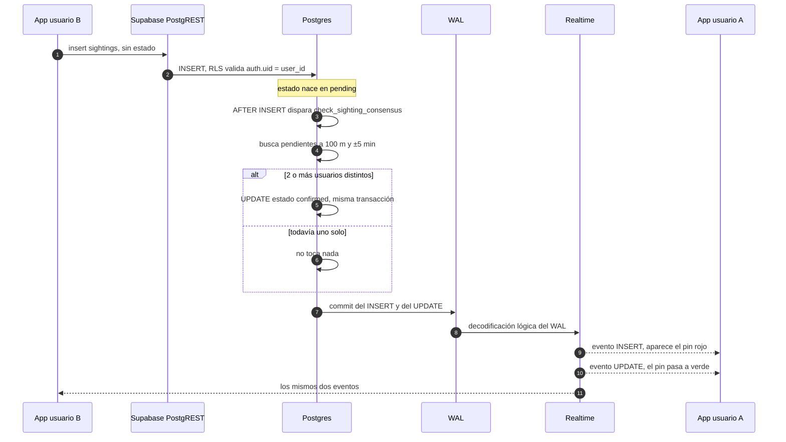

# Spidey-Tracker — cómo está hecho

Notas técnicas del proyecto: cómo se estructura, qué hay en la base de datos y por qué cada pieza está donde está. Para instalarlo y correrlo, mirá el [README](./README.md).

---

## 1. Arquitectura

No hay backend propio. La app habla directo con Supabase, y la lógica que no se puede confiar al cliente vive en Postgres.

```
app/                    Expo Router
  _layout.tsx           AuthProvider + Stack
  index.tsx             guard: sesión → MainPage, sin sesión → AuthPanel
context/AuthContext     sesión de Supabase, persistida en AsyncStorage
hooks/
  useSightings          feed de 24 h + suscripción realtime
  useUbicacion          permiso y seguimiento de GPS
  distancia             haversine del lado del cliente
lib/supabase            cliente único de supabase-js
components/             UI, toda pixel-art
```

Cuatro capas, con una regla por capa:

- **Shell.** [`TrackerFrame`](./components/TrackerFrame.tsx) dibuja el marco pixel-art y deja un hueco; todo lo demás se monta adentro de ese hueco. Se renderiza siempre, incluso mientras la sesión resuelve, así no hay parpadeo negro al arrancar.
- **Sesión.** [`AuthContext`](./context/AuthContext.tsx) es la única fuente de verdad de la sesión. [`app/index.tsx`](./app/index.tsx) la lee y decide qué montar, así que un token expirado o una sesión invalidada desde afuera devuelven al login solos, sin navegación manual.
- **Datos.** Los hooks son los únicos que hablan con Supabase para leer. [`useSightings`](./hooks/useSightings.ts) hace el fetch inicial de las últimas 24 h y después mantiene la lista viva por realtime; los componentes reciben arrays ya resueltos.
- **UI.** [`MainPage`](./components/MainPage.tsx) es el dueño del estado de pantalla — filtros, cámara del mapa, formulario abierto — y los paneles del menú son componentes controlados que reciben la lista y devuelven callbacks.

Un detalle de flujo que explica varias decisiones del código: el formulario de reporte **queda montado aunque se cierre el modal**. Cuando el usuario elige "marcar en el mapa", el modal se esconde para dejar el mapa libre, pero el componente sigue vivo, así al volver con la coordenada conserva la descripción y el horario que ya había cargado. Se remonta con una `key` nueva solo al abrir un reporte desde cero.

---

## 2. Modelo de datos

Una sola tabla. Este es el SQL que está corriendo:

```sql
create table public.sightings (
  id uuid primary key default gen_random_uuid(),
  user_id uuid not null references auth.users(id) on delete cascade,
  latitude decimal(10,8) not null,
  longitude decimal(10,8) not null,
  description text,
  estado text not null default 'pending' check (estado in ('pending', 'confirmed')),
  sighted_at timestamptz not null default now(),
  created_at timestamptz not null default now(),
  confirmed_at timestamptz
);

create index sightings_sighted_at_idx on public.sightings (estado, sighted_at);
```

| Campo | Para qué está |
| --- | --- |
| `id` | Clave primaria. La genera Postgres, no el cliente. |
| `user_id` | Dueño del reporte. La policy de insert exige que coincida con `auth.uid()`, y el `on delete cascade` limpia los reportes si se borra la cuenta. |
| `latitude` / `longitude` | Coordenadas con 8 decimales, que a esta latitud son alrededor de un milímetro. `decimal` y no `float` para que la comparación de distancia sea determinística. |
| `description` | Opcional. El cliente la corta en 200 caracteres; la base no impone tope. |
| `estado` | `pending` o `confirmed`, con `check` para que no entre nada más. Nace siempre en `pending`: el cliente ni siquiera manda esta columna. |
| `sighted_at` | **Cuándo pasó.** Lo elige el usuario, hasta 24 h para atrás. |
| `created_at` | **Cuándo se escribió la fila.** Lo pone Postgres. |
| `confirmed_at` | Se llena cuando el trigger promueve el reporte. `null` mientras siga pendiente. |

### Por qué `sighted_at` y `created_at` son campos distintos

Porque responden preguntas distintas y en este dominio casi nunca coinciden. Alguien ve a Spider-Man, se queda mirando, sigue caminando y reporta veinte minutos después; o carga a la noche algo que vio a la mañana.

Si hubiera una sola columna, habría que elegir cuál de las dos se pierde:

- El **consenso** tiene que comparar el momento del evento. Dos personas que vieron lo mismo lo vieron al mismo tiempo, aunque una haya reportado al toque y la otra media hora más tarde. Con `created_at` esos dos reportes nunca se cruzarían.
- El **mapa** muestra "qué está pasando ahora", que también es `sighted_at`: un avistamiento de hace 20 horas cargado recién no es novedad, es historia.
- `created_at` queda como dato de auditoría: cuándo entró la fila de verdad, sin que la elección del usuario lo pueda mover.

Separarlos también permite validar el rango del evento sin tocar el registro de la escritura, que es lo que hace la constraint del punto 6.

### El índice

```sql
create index sightings_sighted_at_idx on public.sightings (estado, sighted_at);
```

Está armado para la consulta del trigger, que es la que corre en cada insert y filtra primero por `estado = 'pending'` y después por rango de `sighted_at`. El feed del cliente, en cambio, filtra solo por `sighted_at` sin mirar el estado, así que no aprovecha la primera columna del índice. Con el volumen de una demo da igual; a escala convendría un índice adicional solo sobre `sighted_at`.

---

## 3. Row Level Security

```sql
alter table public.sightings enable row level security;

create policy "Cualquier usuario autenticado puede leer los avistamientos"
  on public.sightings for select
  to authenticated
  using (true);

create policy "Cada usuario inserta solo sus propios reportes"
  on public.sightings for insert
  to authenticated
  with check (auth.uid() = user_id);
```

**Lectura abierta entre usuarios autenticados.** La app es un mapa colaborativo: el sentido es ver lo que reportaron los demás. `to authenticated` deja afuera a `anon`, así que sin sesión no se lee nada.

**Insert atado a la identidad.** El `with check (auth.uid() = user_id)` es lo que impide reportar en nombre de otro. Sin eso, un cliente hecho a mano podría mandar dos reportes con `user_id` distintos y auto-confirmarse solo.

### Por qué no hay policy de UPDATE (ni de DELETE)

Es deliberado. Con RLS activo, **lo que no tiene policy está prohibido**: no hace falta escribir una regla que niegue, alcanza con no escribir ninguna.

Un `UPDATE` desde el cliente serviría para exactamente una cosa: escribir `estado = 'confirmed'` a mano. Todo el sistema de consenso se cae si eso es posible. Y como no hay ninguna otra razón legítima para editar un reporte —no se corrige un avistamiento, se reporta otro—, la ausencia de policy es la defensa más simple y la que no se puede olvidar de actualizar.

Lo mismo con `DELETE`: borrar el propio reporte después de que confirmó el de otro le sacaría el respaldo a un dato que ya está confirmado.

El único que escribe la columna `estado` es el trigger, y lo hace desde adentro de la base con privilegios propios.

> **Nota honesta:** la policy de insert valida `user_id` pero no las demás columnas. Un cliente hecho a mano puede mandar su propio `created_at` en el payload y sobrescribir el default. `sighted_at` sí está acotado por la constraint del punto 6. Para producción, un `before insert` que fuerce `created_at = now()` cierra ese hueco.

---

## 4. La función haversine

```sql
create or replace function public.haversine_distance(
  lat1 decimal, lon1 decimal, lat2 decimal, lon2 decimal
) returns double precision
language sql
immutable
set search_path = public
as $$
  select 6371000 * 2 * asin(
    sqrt(
      power(sin(radians(lat2 - lat1) / 2), 2) +
      cos(radians(lat1)) * cos(radians(lat2)) *
      power(sin(radians(lon2 - lon1) / 2), 2)
    )
  );
$$;
```

Devuelve metros entre dos coordenadas, tratando la Tierra como una esfera de 6.371 km de radio.

**Por qué no PostGIS.** PostGIS es la respuesta correcta cuando hacés geografía en serio: índices GiST, `ST_DWithin`, proyecciones, polígonos. Acá el único cálculo geográfico del proyecto es "¿estos dos puntos están a menos de 100 metros?", y para eso:

- **Es una dependencia menos.** Todo el setup de la base es un script SQL que se pega en el editor de Supabase. Sumar PostGIS agrega una extensión que habilitar, un tipo de dato nuevo en la tabla y una capa que entender antes de leer el trigger.
- **El error del modelo esférico es despreciable a esta escala.** A 100 metros, la diferencia contra el elipsoide real está en el orden de centímetros. La imprecisión del GPS de un teléfono es de metros: el modelo no es el eslabón débil.
- **No cambia el plan de ejecución.** Con volumen bajo y un filtro previo por `estado` y `sighted_at`, el cálculo corre sobre pocas filas. El índice espacial de PostGIS recién paga cuando hay que descartar millones de filas por distancia, no decenas.

Los dos modificadores importan: `immutable` le avisa al planner que la función depende solo de sus argumentos y puede cachear el resultado dentro de la consulta; `set search_path = public` la ata a un esquema fijo para que nadie pueda desviarla plantando funciones en otro schema.

La misma fórmula está repetida en el cliente, en [`hooks/distancia.ts`](./hooks/distancia.ts), pero para otra cosa: el filtro visual de "cercanos" a 5 km. Es cálculo de UI sobre datos ya traídos, sin ida y vuelta a la red.

---

## 5. El trigger de consenso

```sql
create or replace function public.check_sighting_consensus()
returns trigger
language plpgsql
security definer
set search_path = public
as $$
declare
  usuarios_distintos int;
  ids_a_confirmar uuid[];
begin
  select count(distinct user_id), array_agg(id)
  into usuarios_distintos, ids_a_confirmar
  from public.sightings
  where estado = 'pending'
    and sighted_at between new.sighted_at - interval '5 minutes'
                       and new.sighted_at + interval '5 minutes'
    and haversine_distance(latitude, longitude, new.latitude, new.longitude) <= 100;

  if usuarios_distintos >= 2 then
    update public.sightings
    set estado = 'confirmed', confirmed_at = now()
    where id = any(ids_a_confirmar);
  end if;

  return new;
end;
$$;

create trigger on_sighting_insert
  after insert on public.sightings
  for each row
  execute function public.check_sighting_consensus();
```

### La regla

Cada vez que entra un reporte, se junta el grupo de reportes **pendientes** que están dentro de **100 metros** y **±5 minutos** del nuevo, contando al recién insertado. Si en ese grupo hay **2 usuarios distintos o más**, todo el grupo pasa a `confirmed` con la misma marca de tiempo.

Tres precisiones que salen del SQL:

- El filtro es `count(distinct user_id)`, no `count(*)`: alguien que reporta dos veces desde su cuenta no se confirma solo.
- El trigger es `after insert`, así que la fila nueva ya es visible para el `select` y entra en el grupo. Por eso el umbral es `>= 2` y no `>= 1` más el nuevo.
- El `update` no dispara este trigger, que está declarado solo sobre `insert`. No hay recursión.

### Por qué `security definer`

La función corre con los privilegios de quien la creó, no de quien la disparó.

Sin eso, el `update` interno se ejecutaría como el usuario que insertó, y RLS lo bloquearía: no hay policy de `UPDATE` para `authenticated`. El trigger no podría confirmar nada.

Y esa es justamente la idea: el permiso de escribir `estado` existe **solo dentro de esta función**, para una operación acotada, escrita a mano y auditable — no como una policy general que después hay que confiar en que nadie use mal. El cliente no tiene el permiso; la función sí, y hace una sola cosa con él.

El `set search_path = public` no es decorativo acá: en una función `security definer`, un `search_path` manipulable es el vector clásico de escalada de privilegios. Fijarlo cierra esa puerta.

### Por qué se revoca el execute

```sql
revoke execute on function public.check_sighting_consensus() from anon, authenticated;
```

Postgres otorga `execute` a `public` por defecto en cada función nueva, y PostgREST —la capa que Supabase expone como API— publica las funciones del esquema `public` como endpoints RPC. Es decir: una función recién creada es, salvo que hagas algo, invocable desde internet con la anon key.

Que ésta en particular sea una función de trigger la vuelve difícil de llamar de forma útil desde afuera —no hay `NEW` fuera del contexto de un trigger—, pero eso es un accidente de su firma, no una defensa. La regla que conviene sostener es más simple: **una función `security definer` no se deja expuesta a la API, nunca**. Corre con privilegios elevados; su única puerta de entrada legítima es el trigger.

### El flujo completo



Lo importante del diagrama es que el `UPDATE` viaja por el mismo camino que el `INSERT`. Realtime no escucha la tabla: escucha el WAL, el registro que Postgres escribe para cada cambio commiteado. Como el trigger corre dentro de la transacción del insert, para cuando el WAL se decodifica ya hay dos eventos, y los clientes se enteran de los dos sin haber preguntado nada.

Por eso [`useSightings`](./hooks/useSightings.ts) se suscribe a `INSERT` **y** a `UPDATE`.

---

## 6. La ventana de 24 horas

```sql
alter table public.sightings
  add constraint sighted_at_valido
  check (sighted_at <= now() + interval '1 minute'
     and sighted_at >= now() - interval '25 hours');
```

Dos bordes:

- **Adelante, 1 minuto de tolerancia.** No se reporta el futuro. El minuto extra absorbe el desfasaje entre el reloj del teléfono y el del servidor, que en un celular con la hora mal configurada puede ser de segundos.
- **Atrás, 25 horas.** El producto ofrece 24; la hora extra existe porque el cliente arma el timestamp restando minutos al reloj *local*. Un teléfono adelantado unos minutos generaría un `sighted_at` apenas fuera de rango y el insert fallaría con un error de constraint incomprensible para el usuario. La hora de más hace que el borde exacto lo decida la UI, y que la base solo atrape lo que está claramente mal.

---

## 7. Decisiones técnicas

### `react-native-maps` en vez de `expo-maps`

`expo-maps` es el módulo nuevo y sigue en **alpha**: API inestable entre releases, y en **iOS solo soporta Apple Maps**, no Google Maps. Eso significaría dos estilos de mapa distintos según la plataforma y dos caminos de código para los marcadores.

`react-native-maps` está en producción hace años, corre Google Maps en Android y iOS con la misma API, acepta el `customMapStyle` oscuro que usa la app y se instala vía config plugin con la key inyectada desde [`app.config.ts`](./app.config.ts). Cuando `expo-maps` sea estable y soporte Google Maps en iOS, la migración es acotada: el mapa vive en un solo componente.

### El consenso se resuelve en la base, no en el cliente

Es la decisión estructural del proyecto. La app podría perfectamente traer los reportes cercanos, contar usuarios distintos y marcar el pin en verde. Sería más fácil de escribir y estaría mal por dos motivos:

- **No se puede falsear desde afuera.** Todo lo que corre en el cliente es una sugerencia: el binario se puede decompilar, y la API de Supabase se puede llamar con `curl` y la anon key. Si el estado lo calculara la app, confirmar un avistamiento inventado sería mandar un `update`. Con la regla en un trigger `security definer` y sin policy de `UPDATE`, la única forma de que algo pase a `confirmed` es que dos usuarios distintos, autenticados, hayan insertado reportes que cumplen la regla.
- **Es transaccional.** El insert y la posible confirmación pasan en la misma transacción, con la fila bloqueada. Dos personas reportando el mismo segundo no producen un estado a medias ni una doble confirmación: Postgres serializa. La misma lógica en el cliente sería una carrera entre dos teléfonos que no se conocen.

Como beneficio lateral: la regla es una sola, en un solo lugar. Un cliente viejo que nadie actualizó no puede quedarse con un umbral distinto.

### Realtime escucha `INSERT` y `UPDATE`

Es la consecuencia directa de lo anterior. Como el trigger corre **después** del insert, el reporte nace `pending` y se confirma un instante más tarde, en un evento separado. Suscribirse solo a `INSERT` haría que los pines aparezcan siempre en rojo y no se pongan verdes hasta el próximo arranque de la app: justo la parte que hace visible el consenso.

En el handler de `INSERT` hay además una guarda por `id` para no duplicar una fila que ya llegó por el fetch inicial, porque el fetch y la suscripción se solapan por unos milisegundos en el arranque.

### La ventana de 24 h está validada dos veces

En el cliente ([`SightingForm`](./components/SightingForm.tsx) acota el selector a 24 h y arma el timestamp recién al enviar) y en la base (la constraint `sighted_at_valido`). No es redundancia por olvido: **son dos trabajos distintos**.

- El del **front es UX**: que el usuario no pueda ni elegir una fecha inválida. Un rango imposible de seleccionar es mejor que un error después de completar el formulario.
- El de la **base es la garantía**: es la única validación que sigue en pie cuando el request no viene de la app. El front se puede saltear; la constraint, no.

La regla general del proyecto es esa: el cliente valida para explicar, la base valida para proteger. Cuando las dos difieren, la base gana.

### Otras decisiones del cliente

- **`tracksViewChanges` se apaga en el `onLoad`, no antes.** `react-native-maps` arma el ícono del marcador rasterizando la vista a un bitmap. Pasarle `tracksViewChanges={false}` de entrada captura una sola vez, y esa captura cae antes de que el PNG termine de decodificar: el marcador queda registrado —responde al tap, abre el callout— pero invisible. [`PinAvistamiento`](./components/PinAvistamiento.tsx) arranca con el tracking prendido y lo apaga cuando la imagen cargó, que es el momento en el que la librería actualiza el ícono una última vez.
- **El teclado del formulario se mide a mano.** El modal del reporte usa `statusBarTranslucent`, lo que en Android lo dibuja en su propia ventana, fuera del alcance del `adjustResize` del sistema. `KeyboardAvoidingView` tampoco ayuda ahí. La solución es escuchar los eventos de teclado y sumar esa altura como padding.
- **La hoja del formulario se anima a mano** en vez de usar `animationType="slide"`, porque el gesto de arrastre tiene que poder tomar la animación a mitad de camino y decidir si la devuelve arriba o termina de cerrarla.
- **"Mis avistamientos" hace su propia consulta.** El feed del mapa está recortado a 24 h; el historial propio no tiene por qué estarlo. Son dos preguntas distintas, así que son dos queries distintas, y la card avisa cuándo un reporte viejo ya no tiene pin al que llevar la cámara.

---

## 8. Qué le falta para producción

Esto es un proyecto de demostración. Lo que habría que resolver antes de poner algo así frente a usuarios reales:

- **No hay moderación ni reputación.** Dos cuentas coordinadas confirman cualquier cosa. Un sistema real necesita peso por usuario según su historial, reportes de abuso, y alguna forma de invalidar un avistamiento confirmado — que hoy no existe, porque no hay policy de `UPDATE` ni estado `rejected`.
- **El umbral de 2 usuarios es bajo a propósito.** Está puesto así para poder mostrar la confirmación en vivo con dos teléfonos. En producción serían más reportes, con radio y ventana calibrados contra datos reales, y probablemente un umbral variable según la densidad de la zona.
- **El consenso solo mira reportes pendientes.** El `where estado = 'pending'` del trigger implica que un tercer reporte que llega tarde a un grupo ya confirmado se queda en `pending`, porque sus vecinos salieron del conjunto. Para el flujo típico —dos personas reportando casi a la vez— funciona; para un avistamiento con mucho tráfico, habría que contemplar también los confirmados cercanos.
- **`longitude decimal(10,8)` no cubre el planeta entero.** Con escala 8 y precisión 10 quedan dos dígitos para la parte entera: el rango real es ±99,99999999. Alcanza para Buenos Aires, que está en -58, pero un reporte con longitud de 100 o más —buena parte de Asia y Oceanía— falla con overflow numérico. La corrección es `decimal(11,8)` en esa columna.
- **Sin fotos.** Es lo primero que pediría cualquiera y lo que más peso daría a un reporte. Implica Supabase Storage, sus propias policies, permisos de cámara y galería, compresión antes de subir, y un placeholder mientras carga.
- **Sin OAuth.** Solo email y contraseña. Google y GitHub agregarían fricción menos al alta, pero requieren configurar los providers en Supabase, el esquema de deep linking y el flujo de redirect en el dev build.
- **El "¿olvidaste tu contraseña?" no está cableado.** El link existe en la UI con un handler vacío. Falta el `resetPasswordForEmail` y la pantalla de destino del deep link.
- **Sin manejo offline.** Si no hay red, el fetch inicial falla y el mapa queda vacío; un reporte enviado sin conexión se pierde. Haría falta cachear el último feed y una cola de escrituras pendientes que reintente al volver la conexión.
- **`created_at` es escribible desde un cliente hecho a mano**, como se explica en la sección de RLS. Un `before insert` que lo fuerce a `now()` lo resuelve.
